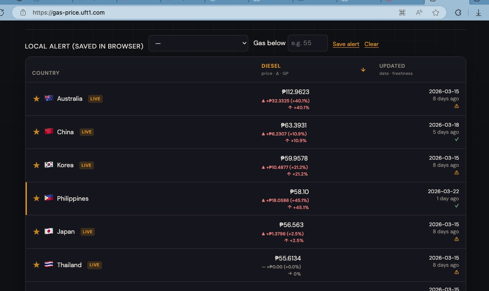

# Fuel Price Tracker




Static fuel-price dashboard powered by repository JSON + live browser merge.

## What this project does

- Shows retail gasoline and diesel prices by country.
- Loads `data/fuel.json` from this repo, then fetches live OpenVan data in the browser.
- Replaces a country row when live `updated_at` is newer (or same calendar day) than the repo row.
- Displays prices in PHP for fast cross-country comparison.
- Supports region presets, country chips, favorites, sorting, and local alerts.
- Includes:
  - Iran-war delta view from `data/war_deltas.json`
  - History chart from `data/history.json`

## Data sources

- Retail fuel: [OpenVan API](https://openvan.camp/api/fuel/prices) (CC BY 4.0)
- War deltas: [GlobalPetrolPrices Iran war trend table](https://www.globalpetrolprices.com/fuel_price_trend_Iran_war.php)
- FX conversion: [Frankfurter (ECB)](https://api.frankfurter.app/)

## Quick start

1. Install dependencies:

```bash
npm install
```

2. Run local static server:

```bash
npx serve .
```

3. Open:

- `http://localhost:3000/` (or the port shown by `serve`)

## Update pipeline

The repo has scripts and CI to refresh datasets:

- `scripts/fetch-fuel.mjs` updates:
  - `data/fuel.json`
  - `data/latest.json`
  - `data/war_deltas.json`
  - `data/history.json`
- GitHub Actions workflow: `.github/workflows/update-fuel.yml`

Run manually:

```bash
npm run fetch
```

## Main files

- `index.html` - page markup
- `app.js` - UI + filtering + charts + local state + live merge
- `styles.css` - styling
- `data/*.json` - snapshot datasets
- `scripts/*.mjs` - fetch/backfill utilities

## Notes

- This is a static site. No backend required.
- Browser localStorage is used for favorites, filters, and alert settings.
- If FX is unavailable, conversion-dependent values may fall back gracefully.
